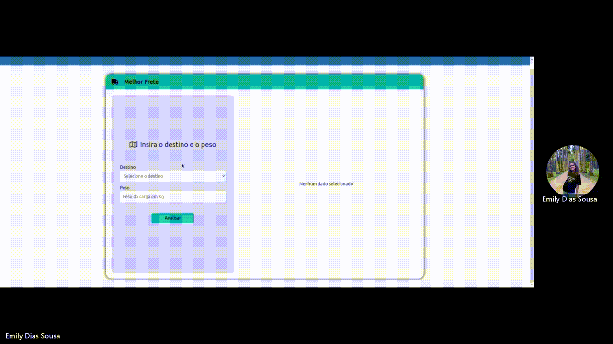

# Fretex

## Desafio
Uma empresa estabelecida em Campinas busca assistência para determinar a opção de transportadora mais adequada, levando em consideração a cidade de destino e o prazo de entrega. A equipe de logística realiza o registro de todas as cotações de frete no sistema de gestão logística da empresa. Por sorte, esse sistema é equipado com uma API REST que disponibiliza de forma estruturada todos os dados coletados das cotações de frete. Tais informações estão formatadas da seguinte maneira:

```
$ curl -i -H "Accept: application/json" -H "Content-Type: application/json" -X GET  http://localhost:3000/transport

[
  {
    "id": 1,                                   <--- ID da cotação
    "name": "Expresso Oriente",                <--- Nome da transportadora
    "cost_transport_light": "R$ 2.10",         <--- Custo de Frete até 100Kg [R$/Kg]
    "cost_transport_heavy": "R$ 1.50",         <--- Custo de Frete mais de 100Kg [R$/Kg]
    "city": "São Paulo",                       <--- Cidade de destino
    "lead_time": "12h"                         <--- Tempo de entrega
  },
]
```


# Requisitos

- node
- npm
- docker
- docker-compose

## Proposta

**História de Usuário: Análise de Frete**

Como analista de logística,
Eu desejo saber qual é o preço do frete mais econômico e o preço do frete mais rápido,
Para tomar decisões mais assertivas ao contratar o serviço de transporte.


**Cenário: Exibição dos Melhores Fretes**

Dado que estou na página de análise de frete,
Quando inserir o peso do frete,
E informar a cidade de destino,
E clicar no botão "Analisar",
Então devo visualizar o nome da transportadora, o custo total e o tempo de entrega do frete mais econômico,
E devo visualizar o nome da transportadora, o custo total e o tempo de entrega do frete mais rápido.


**Aplicação**



## Como rodar a aplicação

Utilize os seguintes comandos para rodar a página do desafio.

```
cd code

npm install

npm run serve
```
Você também vai precisar ligar o servidor da API REST para consultar as cotações dos fretes, utilize o seguinte comando para isso:

```
npm run api_serve
```

Para rodar os testes:

```
npm run test
```

Para rodar com o docker, estando na pasta code:

```
docker-compose up --build
```

Para testar a api, você pode usar o seguinte comando:
```
curl -i -H "Accept: application/json" -H "Content-Type: application/json" -X GET  http://localhost:3000/transport
```

Ele ira retornar uma lista com os valores das cotações, como  exemplo a seguir:
```
$ curl -i -H "Accept: application/json" -H "Content-Type: application/json" -X GET  http://localhost:3000/transport

HTTP/1.1 200 OK
X-Powered-By: Express
Vary: Origin, Accept-Encoding
Access-Control-Allow-Credentials: true
Cache-Control: no-cache
Pragma: no-cache
Expires: -1
X-Content-Type-Options: nosniff
Content-Type: application/json; charset=utf-8
Content-Length: 2837
ETag: W/"b15-f90GSZPs+txwiOzSSKLWg7LqzzE"
Date: Wed, 27 Apr 2022 23:55:34 GMT
Connection: keep-alive
Keep-Alive: timeout=5

[
  {
    "id": 1,
    "name": "Expresso Oriente",
    "cost_transport_light": "R$ 2.10",
    "cost_transport_heavy": "R$ 1.50",
    "city": "São Paulo",
    "lead_time": "12h"
  },
  {
    "id": 2,
    "name": "Expresso Oriente",
    "cost_transport_light": "R$ 4.20",
    "cost_transport_heavy": "R$ 3.10",
    "city": "Belo Horizonte",
    "lead_time": "18h"
  },
]
```